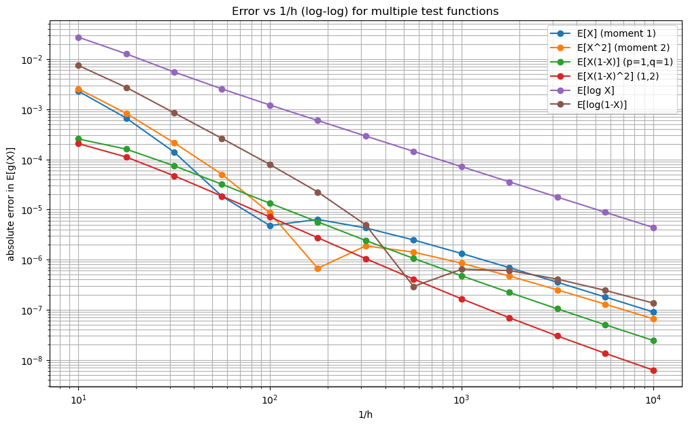

# FiniteMC

This repository contains code and notes for a research project conducted under the supervision of **Peter Glynn** on **error analysis for estimating stationary distributions of Markov chains with compact, continuous state spaces**. :contentReference[oaicite:1]{index=1}

## Project focus

The goal of this project is to understand and quantify the approximation error that arises when computing or estimating a stationary distribution for a Markov chain evolving on a **compact (closed and bounded)** continuous domain (e.g. $[0,1]$ or $[0,1]^d$). We study both methodological and numerical sources of error, including discretization bias and Monte Carlo / quasi–Monte Carlo integration error. :contentReference[oaicite:2]{index=2}

## Methods studied

Two main approaches are analyzed:

1. **Probabilistic grid discretization**
   - Discretize the continuous state space using a grid.
   - Approximate the Markov transition operator by computing (or estimating) transition probabilities between grid cells.
   - Use the resulting finite-state Markov chain to approximate the stationary distribution of the original chain.

2. **Sampling-based estimation using Sobol sequences (QMC)**
   - Estimate integrals and transition expectations using **Sobol low-discrepancy sequences**.
   - Compare standard Monte Carlo with **quasi–Monte Carlo (QMC)** schemes in terms of convergence and error behavior.
   - Use QMC to reduce variance / integration error in stationary distribution estimation.

## Benchmarks / testbeds

To study error in a controlled way, the repo includes compact-state Markov chains where either the stationary distribution is known or we can compute a highly accurate “near-truth” reference.

### 1) Beta–binomial kernel chain (known stationary Beta)

A 1D chain on $[0,1]$ with an explicit transition kernel and known stationary distribution $\mathrm{Beta}(\alpha,\beta)$. This provides a clean baseline for discretization and integration-error experiments.

### 2) Compact AR(1) on $[0,1]$ with CF + inverse FFT benchmark

A compact AR(1)-type chain
$$
X_{n+1} = (1-\lambda) X_n + \lambda Z_{n+1}, \qquad Z_{n+1}\in[0,1]
$$
where the innovations $Z_{n}$ are i.i.d. from a compact distribution (e.g. Beta or truncated normal on $[0,1]$).

For this model, the stationary characteristic function admits an infinite-product form (because the recursion is linear with i.i.d. innovations), and we can recover an accurate stationary density by **inverse Fourier transform using FFT**. In practice:
- we truncate the product at a data-driven level (tail controlled by powers of $(1-\lambda)$),
- invert using a uniform frequency grid and FFT,
- and validate accuracy via moment checks (mean/variance) against analytic formulas.

For Beta innovations, the CF+FFT stationary density implementation matches the analytic stationary mean and variance at (near) machine precision in tested configurations, making it a strong reference benchmark for discretization and QMC.

## Current progress

- Implemented a 1D testbed Markov chain with an explicit transition kernel and known stationary distribution (Beta), enabling controlled error studies.
- Built a grid-based discretization pipeline:
  - Gauss–Legendre quadrature over grid cells to approximate transition probabilities,
  - computation of the discrete stationary distribution as the eigenvector of $P^\top$ corresponding to eigenvalue $1$,
  - conversion of cell masses into a piecewise-constant density estimate.
- Added an evaluation framework based on test functions (rewards) such as moments, boundary-weighted polynomials, and $\log$-type functions to probe boundary sensitivity.
- Ran convergence experiments over grid resolution $h$ and produced log–log error plots against $1/h$.
- Implemented a second benchmark: compact AR(1) stationary density computed via characteristic function product + inverse FFT, with validation against analytic mean/variance (Beta innovations) at near machine-level accuracy.

## Repository contents

Below is a high-level guide to what each file contains:

- `betabin.py`  
  Beta–binomial Markov chain implementation (simulation + vectorized transition kernel) and utilities used in discretization experiments.

- `gridaprox.py`  
  Grid discretization code:
  - builds a grid over $[0,1]$,
  - uses Gauss–Legendre quadrature inside each destination cell to approximate transition probabilities,
  - assembles the finite transition matrix $P$,
  - computes the discrete stationary distribution (eigenvector of $P^\top$),
  - provides expectation/evaluation helpers for test functions.

- `ar1compact.py`  
  Compact AR(1) model on $[0,1]$ and the “near-truth” stationary density routine:
  - stationary CF product (with truncation),
  - inverse FFT to recover density on a grid,
  - optional numerical stabilizations and validation hooks.

- `compactdist.py`  
  Compact innovation distributions used by AR(1):
  - sampling,
  - characteristic function evaluation,
  - mean/variance helpers (e.g. Beta on $[0,1]$, truncated normal on $[0,1]$).

- `utils.py`  
  Small utilities (plotting helpers, experiment wrappers, shared numeric helpers).

- `approximations.ipynb`  
  Interactive notebook for running experiments, generating plots, and checking error curves.

- `1DBetaBinErrors.png`  
  Example output plot for the Beta–binomial discretization error experiments.

## Status

Work in progress — results and implementations will be updated as the project develops.
